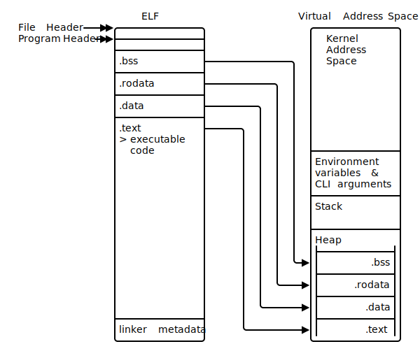

# Learn Rust (yet again)

## Design

- Rust provides **cache-friendly data structures** _by default_
  - usually it's **arrays** that hold data within Rust programs, _NOT_ nested tree structures created by pointers
  - **data-oriented programming**
- Methods are _always_ dispatched statically, unless explicitly requested to do so dynamically
- Utilities written in Rust are compiled as _static binaries_ by default
- **macros** return **code** rather than value
- Rust does _NOT_ have **constructors**
  the convention of `new` method implemented by types is _not_ part of the Rust lang

## Ops

- To compile a release build: `cargo run --release`
  - release build is faster at runtime but slower to compile
- append `-q` to `cargo` to run in quiet mode

## Basic Types

- default integer is `i32`
- default float is `f64`
- `usize` and `isize` - pointer sized integers
  - assume CPU's native width
  - 4 bytes on 32-bit arch
  - 8 bytes on 64-bit arch
- `f32` and `f64` - floating point
- `0b` - binary
  - `{:0b}`
- `0x` - hex
  - `{:0x}`
- `0o` - octal
  - `{:0o}`
- Conversions between types are _always_ **explicit**
  - use `as`
  - or, `use std::convert::TryInto`
    ```rust
    // try_into() returns an i32 wrapped in `Result`
    let num_ = num.try_into().unwrap();
    ```
- **tuple** - `(val, val, ...)`
  - of different types
  - 12 elements max?
  - fixed sequences of values \***\*on stack\*\***
  - to destructure: `let (a, b, c ...) = <some_tuple>;`
- **array** - `[val, val, ...]`
  - collection of _similar_ (same type) elements with fixed length known at _compile time_
  - of type `[T;N]`
  - `let arr = ['x'; 5];`
- **slices** - collection of _similar_ elements with length known at _runtime_

- `as` - numeric type conversions
- constants - ALL_CAP_SNAKE_CASE - **must always** have explicit types
- `::std::f64::INFINITY`
- `::std::f32::NAN`
- `bool` takes _an entire byte_ in memory
- `char` represented by single quotes `''`
  - unicode char `'\u{62}'`
- `()` is a **unit** - returning nothing
  - the `main()` function by default returns `()`
- `main()` function can also return a `Result`

### `String` vs. `str`

- `str` - string slice - text with length known at _runtime_
  - cannot be expanded or shrank once created
  - UTF-8 guaranteed
  - `&str` - contains reference to `str` data and a length
  - attempting to assign a variable to `str` will _FAIL_
  - Rust compiler wants to create fixed-sized variables within a function's stack frame
  - `str` values can be of arbitrary length - can only be stored as local variables by reference
- `String` uses dynamic memory allocation
- Creating `&str` avoids a memory allocation
- `String` is an **owned** type
  - read-write
- `&str` is a **borrowed** type
  - read-only
- string literals are `&str`
  - full type: `&'static str`
- `char` is _ALWAYS_ **4** bytes
  - interanally encoded in UCS-4/UTF-32
  - _ALWAYS_ fixed-length - easier for the compiler
- `[u8]` - slice of raw bytes
- `Vec<u8>` - vector of raw bytes
- `String` <-> `Vec<u8>`
- `str` <-> `[u8]`
- string formatting uses `{}` as formatter
- `std::ffi::OSString` - platform-native string
  - not guaranteed to be UTF-8
  - does _NOT_ contain the zero byte `0x00`
- `std::path::Path` - filesys
- a backslash `\` escapes the newline character in the string literal
- `String` is guaranteed to be UTF-8
  - however reading a text file into `String` may cause errors if there are invalid bytes
  - Better - read in data as `[u8]` (slice of `u8` values) then decode those bytes

### Floating-point Numbers

- Implemented in base 2, but often used in calculations in base 10
- In Rust, `f32` and `f64` _only_ implement `std::cmp::PartialEq`
  - other numeric types _also_ implement `std::cmp::Eq`
- Guidelines:
  - **Avoid testing floating-point numbers for equality**
  - Be wary when results may be mathematically undefined
- `to_bits()`
- Safer to test within an acceptable margin, \***\*epsilon\*\***
- `f32::EPSILON` and `f64::EPSILON`
  - `assert!(abs_diff <= f32::EPSILON);`
- `NAN` - Not A Number
  - _NEVER_ equal to each other
- use `is_nan()` and `is_finite()`
  - they crash

### Arrays vs. Vectors vs. Slices

- array - fixed size and _extremely_ light weight
  - although possible to replace items within an array
  - an array's type: `[T; n]`
- vector - growable but incurs small runtime penalty
- In practice, most interactions with arrays occurs via _another type_, **slice**, `[T]`
  - slice itself is interacted by reference `&[T]`
- slice - dynamically sized array-like objects
  - size _not_ known at compile time
  - _NOT_ resizable
  - _dynamic typing_
  - `[T; n]` vs. `[T]`
  - create a slice from an array - cheap!
  - can be used as a **view** on arrays (and other slices)
  - size of slice itself is _FIXED_ in memory: two `usize` components
    - pointer
    - length
  - `&[T]`
-

## Functions

- use **tuple** to return multiple values from a function
- to return nothing: `return ();` - `()` is _empty tuple_
- to print `()`, use `{:?}`

### Advanced Functions

#### Explicit Lifetime Annotations

- `'a`, `'b`, etc
  - lifetime variables
- `i: &'a i32` - binds lifetime variable `'a` to the lifetime of `i`
  - `i` is a reference to an `i32` with lifetime `a`
- All values bound to a given lifetime must live as long as the last access to any value bound to that lifetime

#### Generics

- **Traits**
  - `fn add<T: std::ops::Add<Output = T>>(i: T, j: T) -> T {}`
  - _all_ Rust operations are defined _within_ **traits**
- _ALL_ Rust operations are systactic sugar for trait's methods
- During compilation, `a + b` is converted to `a.add(b)`
-

## Flow Control

- `for item in container` - `container` becomes _unavailable_ after the `for` loop ends
- Three `for` loops:
  - `for item in collection` - Ownership
  - `for item in &collection` - Read-only
  - `for item in &mut collection` - Read-write
- `n..m` - _exclusive_ range
- `n..=m` - _inclusive_ range
- Try _not_ to use index:
  - performance: `collection[index]` incurs runtime costs for _bounds checking_
  - safety
- `loop` - to loop _forever_
  - until a `break` or termination
- often for long-running servers
- **loop label**
  - prefixed with `'`:
  ```rust
  'outer: for x in 0.. {
    for y in 0.. {
      for z in 0.. {
        if x + y + z > 1000 {
          break 'outer;
        }
      }
    }
  }
  ```
- Rust has no _truth_ or _falsey_ concepts
- `break` returns a value - allows infinite loops to return values
  - `break 123;`
- `match`
  - safer?
  - does _NOT_ fall through - returns _immediately_ when a match is found

## Read from CLI

- Use `clap`
- example usage:
  - `cargo run -- <arg>`
  - `./target/debug/<executable> --help`

## Read from Files

- `BufReader`
  - provides buffered I/O
  - can reduce system calls to OS if the hard disk is congested

## Compound Types

- `#![allow(unused_variables)]`
- `#[allow(dead_code)]`
- a return type of `!` indicates this function _NEVER_ returns
  - when function is guaranteed to crash
  - `panic!()`
  - when there is an infinite loop
- `()` - unit type
  - zero-length tuple
  - the function returns no value
  - expressions ended with `;` returns `()`
- `#[derive(Debug)]`
  - allows for printing for compound types
  - works with `{:?}`
  - the `Debug` trait is implemented for that type
- `String::from()` generates **owned** strings from string literals, which are slices
- accessing fields _by reference_ prevents the **use after move** issues
  - **borrowing**
- the `newtype` pattern
  - `struct SomeNewType(String);`
- `Vec<T>::reserve(&mut self, addtional: uszie)` - reserves `additional` _more_ elements
- `String::from_utf8_lossy(&buffer)` - converts `Vec<u8>` to `String`
  - non-UTF8 bytes are replaced with

### `impl`

- every `struct` can be instantiated through a literal syntax (with `::new()`)
- `struct` fields are _private_ by default, but can be accessed within the module that defines the `struct`

### Errors

- In C: `errno` of `-1`
  - commonly accessed/modified by sys calls
- In Rust: `static mut ERROR: i32 = 0;`
  - `static` - static lifetime valid for the life of the program
- Accessing and modifying `static mut` variables requires the use of an unsafe block

  ```rust
  unsafe {

  }
  ```

- By convention. global variables use `ALL_CAPS`
- `const` included for values that _never_ change
- `let` vs. `const`
  - data behind `let` _can_ change
  - `let` relates more to **aliasing** than **immutability**
  - **aliasing**: having _multiple_ references to the same location in memory at the same time
    - **borrows** (read-only references) to variables declared with `let` _can_ alias the same data
    - **mutable borrows** (read-write references) are _guaranteed to never_ alias data

#### `Result`

- `Result` has two states,
  - `Ok`
  - `Err`
- requires an extra `unwrap()`
  - will crash if unwrapping `Err`
- Calling `.unwrap()` on a `Result` is poor style!

### `enum`

- `.splitn(X)` - splits to at most `X` parts
- `enum` supports `impl`

### `trait`

- Allowing multiple types to implement a certain `trait` enables code reuse and allows the Rust compiler to perform **zero-cost abstraction**
  - by not adding extra data around values within `strcut`s
- `println!`, `print!`, `write!`, `writeln!`, `format!`
  - rely on `Display` and `Debug` traits
  - `{}`

### Privacy

- a `pub struct`'s fields remain _private_
- an `pub enum`'s variants are _public_
- `pub struct`'s methods should also be marked `pub`

### Documentation

- `///` or `//!`
- Use `cargo doc --open` to generate doc for the project _and_ open it in web browser
- Use `cargo doc --no-deps` to not include dependencies

## Lifetimes, Ownership, and Borrowing

- **move** - movement of **ownership**
- _Every_ value in Rust is **owned**
- Types implementing `Copy` trait are duplicated at times that would otherwise be illegal
- primitive types possess **copy semantics**
- all other types have **move semantics**

### Owner

- Owner cleans up when its values' lifetimes end
- `Drop`
  - to implement custom destructor
  - `drop(&mut self)`
- Values _cannot_ outlive their owner

### Best Practices

- Use references where full ownership is not required
- Duplicate the value
- Refactor the code to reduce number of long-lived objects
- Wrap your data in a type designed to assist with movement issues

#### Duplicate the value

- Two modes of duplication: **clone** vs. **copy**, by different traits
  - `std::clone::Clone`
  - `std::marker::Copy`
  - copy is _implicit_ - whenever ownership would otherwise be moved to an inner scope
    - always fast and cheap
    - always identical - copies are bit-for-bit duplicates
  - clone is _explicit_ - `.clone()`
    - may be _slow_ and _expensive_
- Why not always `Copy`?
  - not for non-negligible performance impact
  - not working perfectly on references
  - some types overload the `Clone` trait
- If implementing `Copy` manually, you would _also_ need to implement `Clone`

#### Wrap data within specialty types

- Will incur runtime costs
- `std::rc::Rc`
  - `Rc<T>`
    - **a reference-counted value of type `T`**
    - provides **shared ownership** of `T`
    - prevents `T` from being removed from memory until every owner is removed
    - implements `Clone`
    - does _NOT_ allow mutation!
    - to allow mutation, use `Rc<RefCell<T>>`
      - `let mut mutable_base = <base>.borrow_mut()` - allowing mutation
    - could be an alternative if implementing `Clone` is _prohibitively_ expensive
    - _NOT_ thread safe!!!
    - In multithreaded code, replace with `Arc<T>` and `Arc<Mutex<T>>`

## Data in Depth

### Bit Patterns and Types

- Text files are just binary files that happen to follow a _consistent_ mapping between bit strings and characters
  - **encoding**

```rust
let a: f32 = 42.42;
let frankentype: u32 = unsafe {
  std::mem::transmute(a)
};
```

- `{:032b}` - directive for the `println!()` macro
  - left-pad with 32 zeros
  - right-hand `b` invokes the `std::fmt::Binary` trait
- `{}` invokes `std::fmt::Display` trait
- `{:?}` invokes `std::fmt::Debug` trait
- `std::mem::transmute()` - naively interpret an `f32` as `u32` without affecting any of the underlying bits

### Life of an Integer

```rust
#[allow(arithmetic_overflow)]

fn main() {
  let (a, b) = (200, 200);
  let c: u8 = a + b;
  println!("200 + 200 = {}", c);
}
```

- code below compiles if specifying the `-O` flag: `rustc -O`
  - but gives the _wrong_ answer, 144

#### Endianness

- how bytes layout in CPU
- **Big Endian** - most significant on the left
- **Little Endian** - most significant on the right
- Integers are almost certainly stored in **little endian**

### Decimal Numbers

- Each floating-point number is laid out in memory as **scientific notation**
- Consists of:
  - sign bit
  - exponent
  - mantissa
  - radix, which is `2`
- $(-1)^{signbit} \times mantissa \times Radix^{exponent - bias}$
- allows for both $0$ and $-0$
- To isolate the sign bit, `>> 31`
- To isolate the exponent:
  - `>> 23`
  - AND mask `& 0xff` to exclude the sign bit
  - Decode - subtract `127`
- To isolate mantissa,
  - `& 0x7fffff`
  - calculate weight

### Fixed-Point Number Formats

- Useful for representing fractions
- An option for performing calc on CPUs w/o a floating point unit (FPU)
  - microcontrollers
- Loses accuracy, saves _significant_ space
- \***\*The Q Format\*\*** - fixed-point number format using a single byte
- Q7
  - 7 bits available for representing number and 1 bit for sign
  - `i8`
- **tuple struct** - struct created from unnamed fields
  - `struct Q(i8);`
- `PartialEq` - can be compared using `==`
- `Eq` - any possible values of the type can be compared against any other possible values of the same type
- `impl From<T> for U`
  - `std::convert::From`
  - `std::convert::TryFrom`

### Generating Random Probabilities from Random Bytes

- Division is a _slow_ operation

### Implementing a CPU

- **CHIP-8**

#### CPU RIA/1 - The Adder

- An **operation** (**op**)
  - procedures supported natively by the system
  - **implemented in hardware**
  - **intrinsic operation**
- **Register**
  - containers of data that can be directly accessed by CPU
  - for CHIP-8, each register is `u8`
- **opcode** - a number that maps to an operation
  - on CHIP-8, opcodes include both:
    - operation
    - operands' registers
- Steps to perform _addition_:
  1. Initialize CPU
  2. Load `u8` values into **registers**
  3. Load the addition opcode into `current_operation`
  4. Perform the addition
- Emulator:
  1. Reads the opcode
  2. Decodes instruction
  3. Matches decoded instruction to known opcodes
  4. Dispatches execution of the operation to a specific function
- How to interpret CHIP-8 codes
  - `u16` values made up of 4 **nibbles**
  - **nibble** - half a byte
  - Each opcode (`u16`) is made up of two bytes:
    - **high byte**
    - **low byte**
  - Each byte is made up of two nibbles
    - **high nibble**
    - **low nibble**

```
                 high byte              low byte
              \/          \/         \/          \/
0  x          7           3          E           E
              ^           ^
        high nibble   low nibble
```

#### CPU RIA/2 - The Multiplier

- can execute several instructions in sequence
- 4K memory
- opcode of `0x0000` indicates stopping the CPU
- Limitations:
  - `position_in_memory` is more formally referred to as **program counter**
  - CHIP-8 specifications reserves the first 512 bytes (`0x100`) for the system
- Use the last register as a **carry flag**
  - an operation has overflowed the `u8` register size

#### CPU RIA/3 - The Caller

- Adds the ability to call functions
- _NO_ programming language support
  - _any_ programs still need to be written in binary
- Support for a **stack** - a specialized memory to store the following addresses:
  - the **CALL** opcode - `0x2nnn`
    - `nnn` is the memory address
    - sets `position_in_memory` to `nnn`, the address of the function
  - the **RETURN** opcode - `0x00EE`
    - sets `position_in_memory` to the memory address of the previous CALL opcode
- Function: a sequence of bytes that can be executed by a CPU
- `copy_from_slice(&some_slice)`
- Calling a function:
  1. Store the current memory location on the stack
  2. Increment the stack pointer
  3. Set the current memory location to the intended memory address
- Returning from a function:
  1. Decrement the stack pointer
  2. Retrieve the calling memory address from the stack
  3. Set the current memory location to the intended memory address
- `cargo build --release` _disables_ runtime checks
  - integer overflows/underflows could happen!

## Memory

### Pointers

- Most commonly referred to as `&T` and `&mut T`
  - also `Option<T>` - using null pointer optimization to ensure that `Option<T>` occupies 0 bytes in the compiled binary
  - `None` is represented by a **null pointer** - pointing to invalid memory
- **address space** - retrieval system to make use of physical RAM
  - encoded in `usize`
- pointer vs. Rust's reference
  - references _always_ refer to valid data
  - references are correctly aligned to multiple of `usize`
    - Rust may itself include padding bytes
  - references are able to provide guarantees above ^ for _dynamically sized types_
    - for types with no fixed width in memory, Rust ensures that a **length** is kept alongside the internal pointer
- Three types of pointer types in Rust:
  - **References**
  - **Pointers**
  - **Raw pointers**
- `Cow` - **copy on write**
  - handy when an external source provides a buffer
  - avoids copies - increased runtime performance
- `ffi` - foreign function interface

#### Raw Pointers in Rust

- **raw pointer** - memory address without Rust's standard guarantees
  - unsafe
  - could be null
- dereferencing _must_ occur in `unsafe` block
- `*const T`
- `*mut T`
- a raw pointer to `String`: `*const String`
- a raw pointer to `i32`: `*mut i32`
- Rust references (`&T` and `&mut T`) compile down to raw pointers
- _always_ point to the starting byte of `T`
- _always_ know the width of _type_ `T` in bytes
- Use `std::mem::transmute` to cast a reference to a value as a raw pointer
  - _highly unsafe_
- raw pointers do _NOT_ own their values
  - no compiler checks
- multiple raw pointers to the same data _are_ allowed
- Reasons to use raw pointers:
  - it's _unavoidable_
  - shared access to something is essential and runtime performance is paramount

#### Rust's pointer ecosystem

- **smart pointers**
  - _wrap_ raw pointers
  - with added semantics
- **fat pointer** - refers to memory layout
  - **thin pointers**, such as raw ones, are a single `usize` wide
  - fat pointers are two `usize` wide or more
- `Box<T>` stores a value on **heap**
- `Arc<T>` is _thread safe_ but adds _runtime cost_
- Rust pointer types are _extensible_
- `core::ptr::Unique` - basis for types such as
  - `String`
  - `Box<T>`
  - `Vec<T>`
- `core::ptr::Shared` - basis for
  - `Rc<T>`
  - `Arc<T>`
- `std::rc::Weak` & `std::arc::Weak`
  - for deeply interlinked data structures
  - for single threaed vs. multi threaded programs
  - allow access to data within `Rc`/`Arc` without incrementing its reference count
  - prevents never-ending cycles of pointers
- `alloc::raw_vec::RawVec`
  - underlies `Vec<T>` and `VecDeq<T>`
  - expandable, double-ended queue
- `std::cell::UnsafeCell`
  - basis of `Cell<T>` and `RefCell<T>`
  - for interior mutability

### Allocating Memory

- **stack** vs. **heap**
  - stack is fast;
  - heap is slow;
- To place data on stack, the compiler _must_ know the type's size at _compile time_
  - in Rust - use types that implement `Sized`

```
Stack grows downwards with decreasing values
                      |
                      |
                      |
                      |
                      |
                     \/

                      /\
                      |
                      |
                      |
                      |
                      |
Heap grows upwards with increasing values
```

#### Stack

- **stack frame**, a.k.a. **allocation record**, a.k.a. **activation frame**
  - created as function calls are made
  - contains a function's state during the call
    - arguments
    - pointer to the original call site
    - local variables (except for the data allocated on heap)
  - every stack frame is _different in size_
  -
- A cursor within the CPU updates to reflect the current address of the current stack frame
  - **stack pointer**
- stack pointer decreases in value as stack grows
  - functions are called within functions
- stack pointer increases in value as function returns
- Stack contains _two_ levels of objects:
  - stack frames
  - data
- stack allows access to _multiple_ elements stored within, _not_ just the top item
- stack can include elements of _arbitrary_ size
- `String` vs. `&str`
  - different representations in memory
  - `&str` - allocated on **stack**
  - `String` allocates memory on **heap**
  - functions only accepting `String` will _not_ work with `&str`
  - use generics!
  ```rust
  /*
  takes an argument `x` of type `T`, where `T` implements `AsRef<str>`
  `AsRef<str>` _behaves as_ a reference to `str` _even if it is not_
  */
  fn foo<T: AsRef<str>> (x: T) -> bool {
      x.as_ref().len() > 4
  }
  ```
  - use implicit conversion to read&write - since `&str` is immutable
  ```rust
  /*
  accept _only_ types that can be converted to `String`
  */
  fn foo<T: Into<String>>(x: T) -> bool {
      // performs the conversion within the function
      // performs any logic to the newly created `String`
      x.into().len() > 4
  }
  ```

#### Heap

- an area of program memory for _types_ that do not have known size at compile time
- Some types grow/shrink overtime
  - `String`
  - `Vec<T>`
- Some types unable to tell compiler how much memory to allocate even though these do not change size over time
  - **slices** (`[T]`) - have _NO_ compile time length
    - internally they are a pointer to some part of an array
  - **trait object**
- Variables on the heap _MUST BE_ accessed via a pointer
  - the `Box<T>` value (e.g. `Box::new(42)`) can _only_ be accessed via a pointer
- `Box::new(T)` - allocates `T` on the heap
  - something that has been **boxed** live _on heap_, with a pointer to it _on stack_
- `std::mem::drop()` deletes the object _before_ its scope ends
  - types implementing `Drop` has a `drop()` method, _BUT_ it is _ILLEGAL_ to explicitly call it within user code
  - the boxed value has _NOT_ been deleted from heap,
  - but the memory allocator has marked that heap location as free for reuse
- **Dynamic Memory Allocation** - program asks more memory from OS
  1. request memory from OS via a system call - `alloc()` or `HeapAlloc()`
  2. use the allocated memory
  3. release the unneeded memory back to OS via `free()`/`HeapFree()`
- **Allocator** - the intermediary between program and OS
- Accessing data on stack is _fast_:
  - a function's local variables (on stack) reside _next to_ each other in RAM - **contiguous layout**
  - cache friendly
- Accessing data on heap is _slow_:
  - Variables on heap are _unlikely_ to reside next to each other
  - dereferencing the pointer involves table lookup and trip to main memory
- Data allocated on stack must stay the _same size_ during the lifetime of the program
- Memory allocation speed is _NOT_ well-correlated with allocation size
  - although larger memory allocation _do_ tend to take longer, it is _NOT_ guaranteed
- To minimize heap allocations:
  - Use arrays of _uninitialized_ objects
    - instead of creating objects from scratch as required, create a bulk lot of those with zeroed values
    - when it's time to activate one of the objects, set its value to non-zero
    - can be _DANGEROUS_
  - Use an allocator tuned for the application's access memory profile
  - Investigate `arena::Arena` and `arena::TypedArena`
    - able to create objects on the fly
    - but `alloc()` and `free()` are _only_ called when the arena is created/destroyed

### Virtual Memory

- **Page** - fixed-size block of words in _real_ memory, typically 4KB in size on 64-bit archs
- **Word** - _any_ type that is size of a pointer
  - corresponds to width of the CPU's registers
  - `usize` and `isize` in Rust
- **Page fault**
  - error raised by CPU when a valid memory address is requested that is not currently in a physical RAM
  - signals OS that at least one page must be swapped back into memory
- **Swapping** - migrating a page of memory stored temporarily on disk from main memory _upon request_
- **Virtual memory** - OS view of the physical memory available on the system
- **Page table** - data structure maintained by OS to manage translating virtual -> real memory
- **Segment** - block within virtual memory
  - virtual memory is divided into blocks to minimize space required to translate virtual <-> real memory
- **Segmentation fault** - error raised by CPU when an illegal memory address is requested
- **MMU** - component of CPU that manages memory address translation
  - maintains a cache of recently translated addresses (**TLB**)
- `Box::into_raw()`
- Accessing data in a program requires **virtual addresses** - the _ONLY_ addresses accessible by the program
  - translation performed by CPU
  - instructions stored in OS
- \***\*Memory Management Unit\*\*** (MMU) - within CPU to perform translation
  - every virtual address is mapped to a physical address
  - instructions stored in a pre-defined address in memory
  - in the worst case, _every_ attempt at accessing memory addresses incurs _two_ memory lookups
- \***\*Translation Lookaside Buffer\*\*** (TLB)
  - cache of recently translated addresses, maintained by CPU
  - has its own (fast) memory
  - typically around 100 pages on x86 archs
  - reaching its capacity can be costly
- virtual addresses are grouped into blocks, **pages**
  - typically 4KB in size
  - avoids **memory fragmentation**
- Having a virtual address space allows OS to _overallocate_
- Inactive memory **pages** can be **swapped** to disk in a byte-for-byte manner, until it's requested by the active program
  - often used during high contention for memory
- **Compression**, among other size optimizations, can be performed
- Paging can speed up the loading of shared libraries
- Paging adds security between programs
  - OS can add other attributes



#### Guidelines

- Keep hot working portions of the program within 4KB of size
- If 4KB is unreasonable, keep under 4KB \* 100
  - so that CPU can maintain its TLB in good order
- Avoid deeply nested data structures with pointer spaghetti
- Test the ordering of nested loops

#### Working with OS

- `kernel.dll` on Windows
